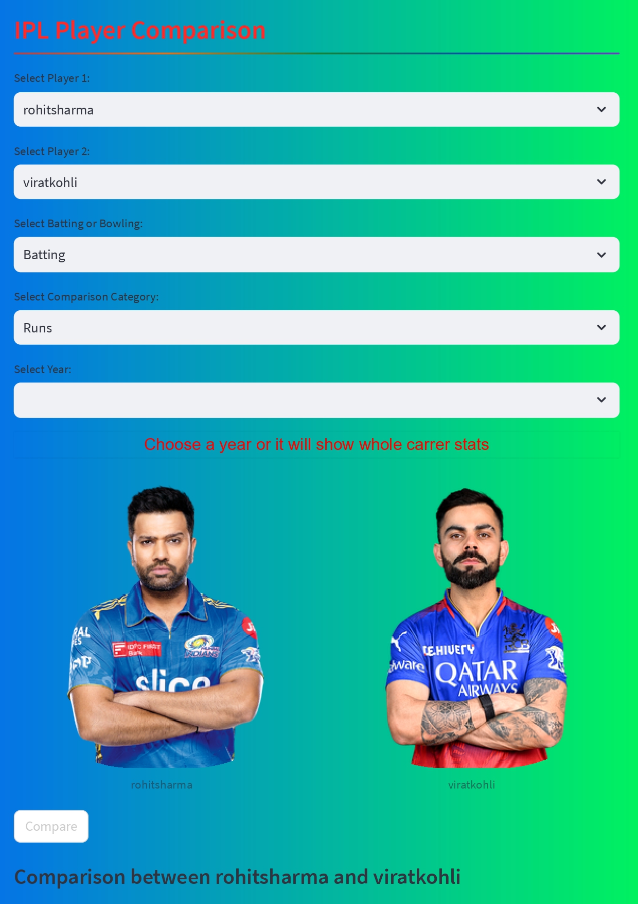

# IPL Player Comparison Game

## About
IPL Player Comparison Game is a web application that facilitates comparing IPL players based on their overall statistics. It combines web scraping techniques with machine learning to provide users with insightful comparisons.

### Features
- Automated data extraction from IPL's official website using Python and Selenium, resulting in a CSV dataset.
- Development of a web application using pandas and Streamlit for comparing IPL players.
- Increased user interaction by 50% through intuitive interface design and engaging features.

## Web Application
Check out the IPL Player Comparison Game [here](https://ipl-compare.streamlit.app/).

